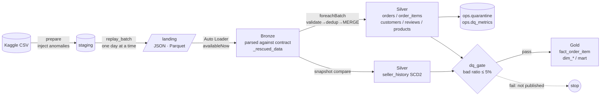
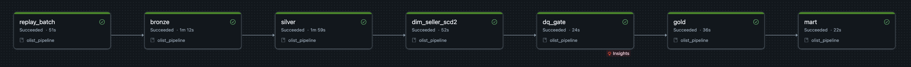
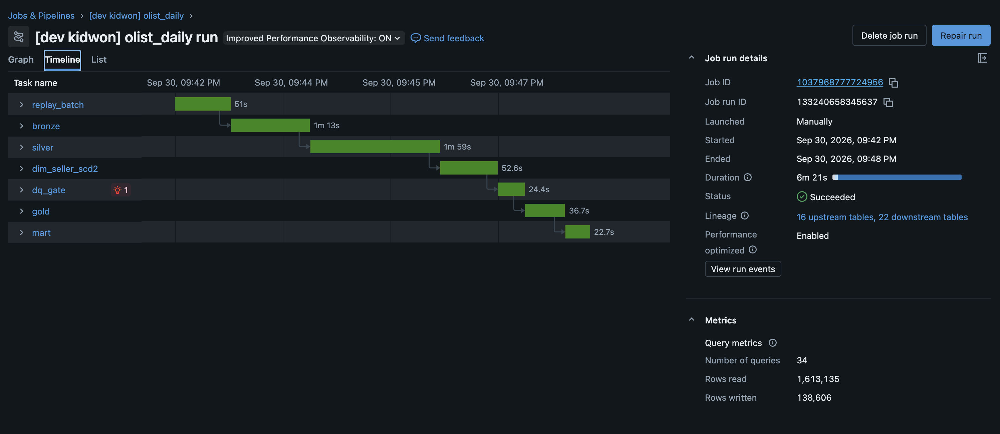
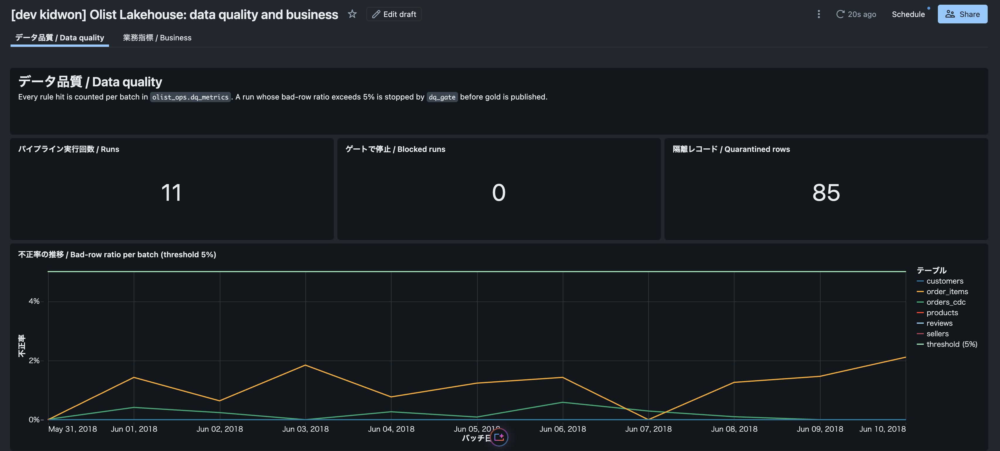
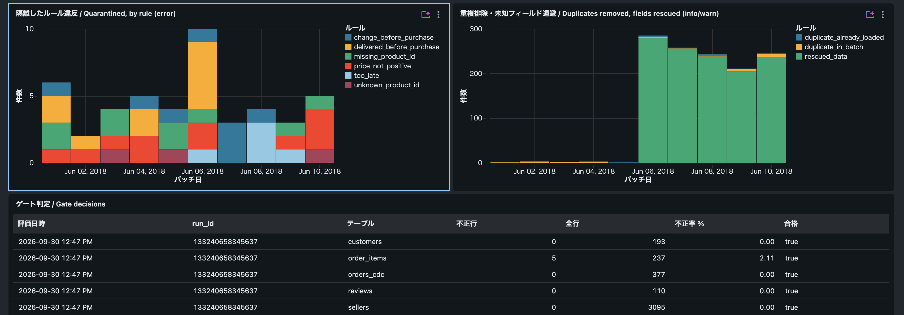
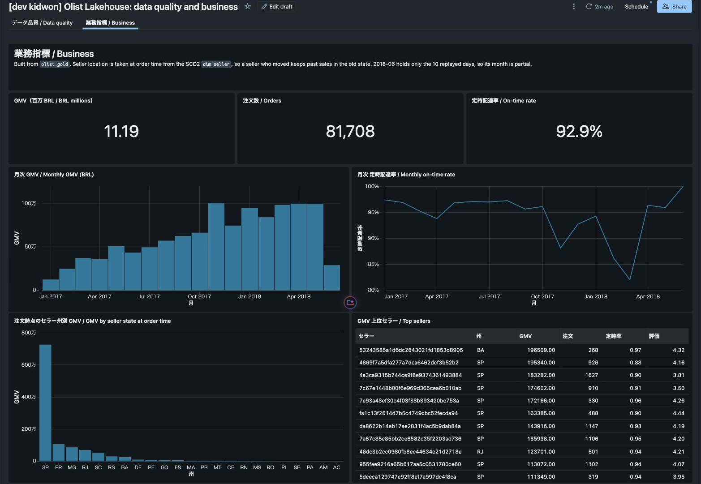

# Olist Lakehouse Pipeline

[日本語](README.md) | **English** | [中文](README.zh.md)


A data engineering portfolio project. It replays the Brazilian e-commerce dataset
[Olist](https://www.kaggle.com/datasets/olistbr/brazilian-ecommerce) (~100k orders) as daily
file drops and builds **incremental ingestion → validation and quarantine → CDC / SCD2 → star
schema** on Databricks.
The replay injects duplicates, late rows, invalid values, out-of-order CDC, a schema change
and seller relocations on purpose. The tests prove that the pipeline's own metrics catch every
one of them.

---

## Architecture



Databricks job (`resources/olist_jobs.yml`, serverless):
`replay_batch → bronze → silver → dim_seller_scd2 → dq_gate → gold → mart`

---

## Five engineering problems and how they are solved

| Problem | Solution | Decision | Code | Test |
|---|---|---|---|---|
| **Incremental ingestion and duplicates** (re-sent lines, job retries) | Checkpointed Auto Loader ingests each file once. `row_number` removes duplicates inside a batch, and an insert-only MERGE ignores lines already loaded | [ADR-0001](docs/adr/en/0001-idempotent-ingestion-and-dedup.md) | [bronze.py](src/olist_pipeline/bronze.py), [silver.py](src/olist_pipeline/silver.py) | `test_redelivered_item_is_not_counted_twice` |
| **Out-of-order CDC** (an older status change arrives later) | Forward-only MERGE: update only when `change_seq` is higher | [ADR-0002](docs/adr/en/0002-cdc-forward-only-merge.md) | `merge_cdc_forward_only` | `test_late_older_change_does_not_regress_status` |
| **SCD Type 2** (report on where a seller was when the order was placed) | Hash-based change detection. One MERGE closes the old version and inserts the new one, and the fact joins point-in-time on the order date | [ADR-0003](docs/adr/en/0003-scd2-sellers.md) | [scd2.py](src/olist_pipeline/scd2.py) | `test_fact_uses_the_seller_version_valid_on_the_order_date` |
| **Late data** (which day does a sale count on?) | Dated by the sale. Up to 3 days late, gold is corrected through MERGE; beyond that, the row is quarantined | [ADR-0004](docs/adr/en/0004-late-data.md) | `add_lateness`, `merge_fact` | `test_late_items_are_accepted_and_dated_by_the_sale` |
| **Data quality** (where do bad rows go, who notices, when do we stop?) | Quarantine with named rules and per-batch metrics. If more than 5% of a run's rows are bad, gold is not published | [ADR-0005](docs/adr/en/0005-data-quality-gate.md) | [quality.py](src/olist_pipeline/quality.py), [gate.py](src/olist_pipeline/gate.py) | `test_gate_blocked_only_the_poisoned_run` |

More decisions: [accumulating snapshot for order fulfillment](docs/adr/en/0009-accumulating-snapshot-fulfillment.md),
[data contracts and `_rescued_data`](docs/adr/en/0006-data-contracts-and-rescued-data.md),
[customer identity (`customer_unique_id`)](docs/adr/en/0007-customer-identity.md),
[imperative vs. declarative (Lakeflow)](docs/adr/en/0008-imperative-vs-declarative.md)

---

## Evidence

### Injected anomalies vs. what the pipeline reported

Local run on the synthetic fixture: a backfill plus 6 daily batches. The base data is clean,
so every reported anomaly must have been injected, and every injected anomaly must be
reported. The end-to-end tests assert this on every run.

| Injected (`ops.replay_manifest`) | Injected | Reported by (`ops.dq_metrics`) | Reported |
|---|---:|---|---:|
| negative price | 8 | `price_not_positive` | 8 |
| missing product id | 6 | `missing_product_id` | 6 |
| unknown product id | 6 | `unknown_product_id` | 6 |
| too late (5 days) | 1 | `too_late` | 1 |
| duplicate in the same batch | 16 | `duplicate_in_batch` | 16 |
| re-sent the next day | 8 | `duplicate_already_loaded` | 8 |
| delivered before purchase | 3 | `delivered_before_purchase` | 3 |
| new field `discount_amount` | 314 | `rescued_data` | 314 |

### Tests (`uv run pytest`, 41 tests)
- **27 unit tests:** de-duplication, forward-only CDC, SCD2 (idempotency, "missing is not
  deleted", point-in-time join), DQ rule boundaries, contract parsing, customer identity, and
  the mart's GMV definition.
- **14 end-to-end tests:** a backfill plus 6 replayed days, with the last day poisoned at
  about 12% bad rows. They reconcile every anomaly, check that the gate blocks only the
  poisoned day, check that a rerun changes nothing, and check that gold catches up on the
  next run.

### Results on the real data (Olist, ~100k orders)

Local run: a backfill plus 10 daily batches (11 runs, about 6.5 minutes). Every run passed
the gate; the highest bad-row ratio was 2.11%. Every injected anomaly was reported, with the
same count as injected.

The real data surfaced problems that the synthetic fixture could not, and each one is now
handled:

| Found in the real data | Size | Handling |
|---|---|---|
| Carrier hand-off timestamp before the purchase (e.g. purchase 2018-07, hand-off 2018-01) | 166 orders (0.17%) in the source; 47 change rows inside the replay window | New rule `change_before_purchase` quarantines them; otherwise an order would exist months before it was placed |
| UTF-8 BOM at the start of the category translation CSV | 1 file | BOM stripped from column names; the fixture now has a BOM too, as a regression test |
| `customer_id` is issued per order | 82,406 `customer_id`s → 79,682 people | Customer dimension per `customer_unique_id` (ADR-0007) |
| Categories with no English translation | 13 products | English name stays NULL; the original category name is kept |
| Order milestones out of order (handed to the carrier before payment approval 559, before the purchase 46, delivered before the handoff 23) | 628 orders (0.76%) | The accumulating snapshot sets negative durations to NULL, flags the order and reports a warning metric (ADR-0009) |

### Screenshots (Databricks Free Edition)

**Daily job `olist_daily`:** 7 tasks run in sequence on serverless compute, about 6.5 minutes
per run (11 successful runs in a row).





**Data quality dashboard:** across all 11 runs the bad-row ratio stays far below the 5%
threshold (max 2.1%), and no run was blocked. Quarantined rows per rule, and duplicates removed /
fields rescued, are shown per day.





**Business dashboard:** GMV, on-time delivery rate and GMV by state from the gold layer; the
state comes from the SCD2 `dim_seller` as of the order date. The dashboard is generated by
`scripts/build_dashboard.py` and deployed with the Asset Bundle.



---

## Walkthrough notebooks (日本語 / English / 中文)

[`notebooks/walkthrough/`](notebooks/walkthrough/) holds seven notebooks, one per layer. Each imports
the production functions directly and runs them on a few hand-written rows: change an input,
rerun, see the behaviour. Each ends with "Try it yourself" and "In the interview". CI runs every
notebook, so the explanations cannot drift from the code.

| Notebook | Topic |
|---|---|
| [`00_overview`](notebooks/walkthrough/00_overview.py) | Architecture and code map |
| [`01_replay`](notebooks/walkthrough/01_replay.py) | Static data to a daily feed; anomaly injection |
| [`02_bronze_contracts`](notebooks/walkthrough/02_bronze_contracts.py) | Data contracts and `_rescued_data` |
| [`03_silver_dedup_cdc`](notebooks/walkthrough/03_silver_dedup_cdc.py) | De-duplication and forward-only CDC |
| [`04_scd2`](notebooks/walkthrough/04_scd2.py) | Seller SCD2 and point-in-time joins |
| [`05_quality_gate`](notebooks/walkthrough/05_quality_gate.py) | Rules, quarantine, metrics and the gate |
| [`06_gold`](notebooks/walkthrough/06_gold.py) | Star schema, customer identity, GMV definition |
| [`07_fulfillment`](notebooks/walkthrough/07_fulfillment.py) | Accumulating snapshot, right-censoring |

---

## Tables

| Layer | Table | Content |
|---|---|---|
| Bronze | `olist_bronze.{orders_cdc, order_items, customers, reviews, sellers, products}` | contract-parsed rows, the raw line, `_rescued_data` and ingestion metadata |
| Silver | `olist_silver.orders` | latest state per order, after CDC |
| Silver | `olist_silver.order_items` | de-duplicated items with `event_date` and `arrival_lag_days` |
| Silver | `olist_silver.order_changes` | append-only log of validated order status changes (audit trail) |
| Silver | `olist_silver.seller_history` | SCD2 history of sellers |
| Silver | `olist_silver.{customers, reviews, products}` | validated reference data and reviews |
| Gold | `olist_gold.fact_order_item` | grain: order item; carries the point-in-time `seller_sk` |
| Gold | `olist_gold.fact_order_fulfillment` | accumulating snapshot: one row per order, every milestone and the hours per stage |
| Gold | `olist_gold.dim_{date, customer, product, seller}` | dimensions; customers are per `customer_unique_id` |
| Gold | `olist_gold.mart_seller_delivery_performance` | seller × month: GMV, on-time rate, review score |
| Ops | `olist_ops.{dq_metrics, quarantine, dq_gate_log, replay_manifest}` | quality metrics, quarantine, gate decisions, replay plan (ground truth) |

---

## Running it

### Locally (no Databricks account needed)
Requirements: Python 3.12, [uv](https://docs.astral.sh/uv/), and **Java 17 or 21** (required by PySpark 4).

```bash
uv sync --python 3.12
uv run pytest                                   # unit + e2e on synthetic data (~4 min)

./scripts/download_olist.sh                     # needs a Kaggle API token
uv run olist run-local --base-path ./data       # real data: backfill + 10 daily batches
```

### Databricks (designed to run on Free Edition)
```bash
databricks auth login --host https://<your-workspace>.cloud.databricks.com
./scripts/download_olist.sh
./scripts/deploy_databricks.sh                  # upload to a Volume → bundle deploy → run olist_setup
databricks bundle run olist_daily               # each run delivers and processes one day (repeat 10 times)
```

---

## Layout

```
src/olist_pipeline/
  contracts.py   data contracts for the six feeds
  replay.py      Kaggle CSV → daily file drops, anomaly injection and manifest
  bronze.py      Auto Loader / file stream, contract parsing, _rescued_data
  quality.py     rules, quarantine, metrics
  silver.py      validate → de-duplicate → MERGE (forward-only CDC)
  scd2.py        seller SCD Type 2
  gate.py        DQ gate
  gold.py        star schema and mart
  cli.py         job task entry point (local and Databricks)
tests/           unit tests, e2e tests, synthetic Olist fixture
resources/       Databricks Asset Bundle job definitions
docs/adr/        architecture decision records (Japanese / English / Chinese)
```

## Next steps
- Use Change Data Feed to limit the gold MERGE source to changed keys
- The same spec on Lakeflow Declarative Pipelines, for comparison

---

Data: *Brazilian E-Commerce Public Dataset by Olist* (CC BY-NC-SA 4.0). The data is not
included in this repository; the download script fetches it.
