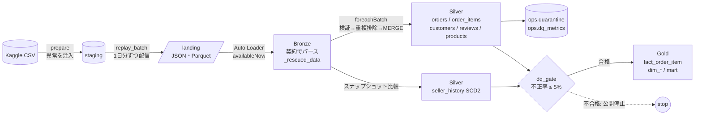

# Olist Lakehouse Pipeline

**日本語** | [English](README.en.md) | [中文](README.zh.md)


ブラジルの EC データセット [Olist](https://www.kaggle.com/datasets/olistbr/brazilian-ecommerce)（約10万注文）を「毎日ファイルで届くデータ」として再生し、Databricks 上で **増分取り込み → 検証・隔離 → CDC / SCD2 → スタースキーマ** を構築するデータエンジニアリングのポートフォリオです。
重複・遅延・不正値・CDC の順序逆転・スキーマ変更・セラーの移転を意図的に混入させ、そのすべてをパイプライン自身のメトリクスで検知できることを、テストで証明しています。

---

## アーキテクチャ



Databricks ジョブ（`resources/olist_jobs.yml`、サーバーレス）:
`replay_batch → bronze → silver → dim_seller_scd2 → dq_gate → gold → mart`

---

## 5つのエンジニアリング課題と解決策

| 課題 | 解決策 | 設計判断 | 実装 | テスト |
|---|---|---|---|---|
| **増分取り込みと重複**（同じ明細の再送・ジョブのリトライ） | チェックポイント付き Auto Loader でファイルを1回だけ取り込み、バッチ内は `row_number`、バッチ間は INSERT のみの MERGE で重複を排除 | [ADR-0001](docs/adr/ja/0001-idempotent-ingestion-and-dedup.md) | [bronze.py](src/olist_pipeline/bronze.py), [silver.py](src/olist_pipeline/silver.py) | `test_redelivered_item_is_not_counted_twice` |
| **CDC の順序逆転**（古いステータス変更が後から届く） | `change_seq` が大きい場合のみ更新する前進方向の MERGE | [ADR-0002](docs/adr/ja/0002-cdc-forward-only-merge.md) | `merge_cdc_forward_only` | `test_late_older_change_does_not_regress_status` |
| **SCD Type 2**（セラーの移転後も、注文時点の所在地で集計したい） | ハッシュで変更を検知し、1回の MERGE で旧版をクローズして新版を挿入。ファクトは注文日で時点結合 | [ADR-0003](docs/adr/ja/0003-scd2-sellers.md) | [scd2.py](src/olist_pipeline/scd2.py) | `test_fact_uses_the_seller_version_valid_on_the_order_date` |
| **遅延データ**（どの日に計上するか） | 販売日で計上し、3日以内なら Gold を MERGE で遡って修正。3日超は隔離 | [ADR-0004](docs/adr/ja/0004-late-data.md) | `add_lateness`, `merge_fact` | `test_late_items_are_accepted_and_dated_by_the_sale` |
| **データ品質**（不正な行はどこへ行き、誰が気付き、いつ止めるか） | ルールごとに隔離しメトリクスを記録。実行単位で不正率 5% を超えたら Gold を公開しない | [ADR-0005](docs/adr/ja/0005-data-quality-gate.md) | [quality.py](src/olist_pipeline/quality.py), [gate.py](src/olist_pipeline/gate.py) | `test_gate_blocked_only_the_poisoned_run` |

その他の判断: [データ契約と `_rescued_data`](docs/adr/ja/0006-data-contracts-and-rescued-data.md)、[顧客の名寄せ（`customer_unique_id`）](docs/adr/ja/0007-customer-identity.md)、[命令型と宣言型（Lakeflow）の比較](docs/adr/ja/0008-imperative-vs-declarative.md)

---

## 検証結果

### 注入した異常とパイプラインの検知結果の突き合わせ

ローカルで合成フィクスチャを使い、バックフィル＋日次6バッチを実行した結果です。ベースデータに異常はないため、検知された異常はすべて注入したものであり、注入した異常はすべて検知されている必要があります。E2E テストはこの一致を毎回検証しています。

| 注入した異常（`ops.replay_manifest`） | 注入件数 | 検知したメトリクス（`ops.dq_metrics`） | 検知件数 |
|---|---:|---|---:|
| 負の価格 | 8 | `price_not_positive` | 8 |
| 商品 ID の欠落 | 6 | `missing_product_id` | 6 |
| 存在しない商品 ID | 6 | `unknown_product_id` | 6 |
| 許容を超える遅延（5日） | 1 | `too_late` | 1 |
| 同一バッチ内の重複 | 16 | `duplicate_in_batch` | 16 |
| 翌日の再送 | 8 | `duplicate_already_loaded` | 8 |
| 購入前の配達日時 | 3 | `delivered_before_purchase` | 3 |
| 新しいフィールド `discount_amount` | 314 | `rescued_data` | 314 |

### テスト（`uv run pytest`、26件）
- **単体テスト 16件:** 重複排除、CDC の前進方向マージ、SCD2（冪等性、欠落は削除ではないこと、時点結合）、DQ ルールの境界値、契約パース、顧客の名寄せ、マートの GMV 定義
- **E2E テスト 10件:** バックフィル＋6日分をリプレイ（最終日は不正率約12%で汚染）。すべての異常の突き合わせ、ゲートが汚染日だけを止めること、再実行で何も変わらないこと、後続の実行で Gold が追い付くことを検証

### スクリーンショット（Databricks Free Edition）
<!-- 実行後に追加: docs/images/job_run.png, docs/images/dq_dashboard.png, docs/images/biz_dashboard.png -->
_Databricks 上での実行後に追加予定です：ジョブの実行グラフ、データ品質ダッシュボード、業務ダッシュボード（クエリは [docs/dashboard_queries.sql](docs/dashboard_queries.sql)）。_

---

## テーブル一覧

| レイヤー | テーブル | 内容 |
|---|---|---|
| Bronze | `olist_bronze.{orders_cdc, order_items, customers, reviews, sellers, products}` | 契約でパースした行、元の行、`_rescued_data`、取り込みメタデータ |
| Silver | `olist_silver.orders` | 注文ごとの最新状態（CDC 適用後） |
| Silver | `olist_silver.order_items` | 重複排除済みの明細。`event_date` と `arrival_lag_days` を持つ |
| Silver | `olist_silver.seller_history` | セラーの SCD2 履歴 |
| Silver | `olist_silver.{customers, reviews, products}` | 検証済みのマスタとレビュー |
| Gold | `olist_gold.fact_order_item` | 粒度: 注文明細。注文時点のセラー（`seller_sk`）を持つ |
| Gold | `olist_gold.dim_{date, customer, product, seller}` | ディメンション（顧客は `customer_unique_id` 単位） |
| Gold | `olist_gold.mart_seller_delivery_performance` | セラー × 月: GMV、定時配達率、レビュー平均 |
| Ops | `olist_ops.{dq_metrics, quarantine, dq_gate_log, replay_manifest}` | 品質メトリクス、隔離、ゲート判定、リプレイ計画（正解データ） |

---

## 実行方法

### ローカル（Databricks アカウント不要）
前提: Python 3.12、[uv](https://docs.astral.sh/uv/)、**Java 17 または 21**（PySpark 4 の要件）

```bash
uv sync --python 3.12
uv run pytest                                   # 単体 + E2E（合成データ、約4分）

./scripts/download_olist.sh                     # Kaggle API トークンが必要
uv run olist run-local --base-path ./data       # 実データでバックフィル + 日次10バッチ
```

### Databricks（Free Edition で動作するよう設計）
```bash
databricks auth login --host https://<your-workspace>.cloud.databricks.com
./scripts/download_olist.sh
./scripts/deploy_databricks.sh                  # Volume へアップロード → bundle deploy → olist_setup 実行
databricks bundle run olist_daily               # 1回の実行で1日分を配信して処理（10回繰り返す）
```

---

## リポジトリ構成

```
src/olist_pipeline/
  contracts.py   6つのフィードのデータ契約
  replay.py      Kaggle CSV → 日次ファイル配信 + 異常注入 + マニフェスト
  bronze.py      Auto Loader / ファイルストリーム、契約パース、_rescued_data
  quality.py     ルール、隔離、メトリクス
  silver.py      検証 → 重複排除 → MERGE（CDC は前進方向のみ）
  scd2.py        セラーの SCD Type 2
  gate.py        DQ ゲート
  gold.py        スタースキーマとマート
  cli.py         ジョブタスクのエントリポイント（ローカル / Databricks 共通）
tests/           単体テスト、E2E テスト、合成 Olist フィクスチャ
resources/       Databricks Asset Bundle のジョブ定義
docs/adr/        設計判断の記録（日本語 / 英語）
```

## 今後の拡張
- 注文のライフサイクルを表す累積スナップショット型ファクト（`fact_order_status_history`）
- Change Data Feed を使い、Gold の MERGE 元を変更キーだけに絞る
- 同じ仕様を Lakeflow Declarative Pipelines で実装し、比較する

---

データ: *Brazilian E-Commerce Public Dataset by Olist*（CC BY-NC-SA 4.0）。本リポジトリにはデータを含めず、スクリプトで取得します。
