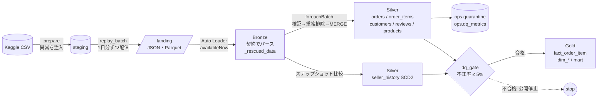
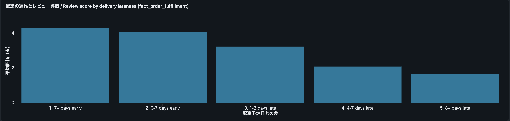

# Olist Lakehouse Pipeline

**日本語** | [English](README.en.md) | [中文](README.zh.md)


ブラジルの EC データセット [Olist](https://www.kaggle.com/datasets/olistbr/brazilian-ecommerce)（約10万注文）を「毎日ファイルで届くデータ」として再生し、Databricks 上で **増分取り込み → 検証・隔離 → CDC / SCD2 → スタースキーマ** を構築するデータエンジニアリングのポートフォリオです。
重複・遅延・不正値・CDC の順序逆転・スキーマ変更・セラーの移転を意図的に混入させ、そのすべてをパイプライン自身のメトリクスで検知できることを、テストで証明しています。

---

## アーキテクチャ



Databricks ジョブ（`resources/olist_jobs.yml`、サーバーレス）:
`replay_batch → bronze → silver → dim_seller_scd2 → dq_gate → gold → mart`

---

## 5つのエンジニアリング課題と解決策

| 課題 | 解決策 | 設計判断 | 実装 | テスト |
|---|---|---|---|---|
| **増分取り込みと重複**（同じ明細の再送・ジョブのリトライ） | チェックポイント付き Auto Loader でファイルを1回だけ取り込み、バッチ内は `row_number`、バッチ間は INSERT のみの MERGE で重複を排除 | [ADR-0001](docs/adr/ja/0001-idempotent-ingestion-and-dedup.md) | [bronze.py](src/olist_pipeline/bronze.py), [silver.py](src/olist_pipeline/silver.py) | `test_redelivered_item_is_not_counted_twice` |
| **CDC の順序逆転**（古いステータス変更が後から届く） | `change_seq` が大きい場合のみ更新する前進方向の MERGE | [ADR-0002](docs/adr/ja/0002-cdc-forward-only-merge.md) | `merge_cdc_forward_only` | `test_late_older_change_does_not_regress_status` |
| **SCD Type 2**（セラーの移転後も、注文時点の所在地で集計したい） | ハッシュで変更を検知し、1回の MERGE で旧版をクローズして新版を挿入。ファクトは注文日で時点結合 | [ADR-0003](docs/adr/ja/0003-scd2-sellers.md) | [scd2.py](src/olist_pipeline/scd2.py) | `test_fact_uses_the_seller_version_valid_on_the_order_date` |
| **遅延データ**（どの日に計上するか） | 販売日で計上し、3日以内なら Gold を MERGE で遡って修正。3日超は隔離 | [ADR-0004](docs/adr/ja/0004-late-data.md) | `add_lateness`, `merge_fact` | `test_late_items_are_accepted_and_dated_by_the_sale` |
| **データ品質**（不正な行はどこへ行き、誰が気付き、いつ止めるか） | ルールごとに隔離しメトリクスを記録。実行単位で不正率 5% を超えたら Gold を公開しない | [ADR-0005](docs/adr/ja/0005-data-quality-gate.md) | [quality.py](src/olist_pipeline/quality.py), [gate.py](src/olist_pipeline/gate.py) | `test_gate_blocked_only_the_poisoned_run` |

その他の判断: [注文フルフィルメントの累積スナップショット](docs/adr/ja/0009-accumulating-snapshot-fulfillment.md)、[日次注文残の定期スナップショット](docs/adr/ja/0010-periodic-snapshot-backlog.md)、[Change Data Feed による Gold の増分処理](docs/adr/ja/0011-incremental-gold-cdf.md)、[同じ仕様の Lakeflow 版との比較](docs/adr/ja/0012-lakeflow-comparison.md)、[データ契約と `_rescued_data`](docs/adr/ja/0006-data-contracts-and-rescued-data.md)、[顧客の名寄せ（`customer_unique_id`）](docs/adr/ja/0007-customer-identity.md)、[命令型と宣言型（Lakeflow）の比較](docs/adr/ja/0008-imperative-vs-declarative.md)

---

## 検証結果

### 注入した異常とパイプラインの検知結果の突き合わせ

ローカルで合成フィクスチャを使い、バックフィル＋日次6バッチを実行した結果です。ベースデータに異常はないため、検知された異常はすべて注入したものであり、注入した異常はすべて検知されている必要があります。E2E テストはこの一致を毎回検証しています。

| 注入した異常（`ops.replay_manifest`） | 注入件数 | 検知したメトリクス（`ops.dq_metrics`） | 検知件数 |
|---|---:|---|---:|
| 負の価格 | 8 | `price_not_positive` | 8 |
| 商品 ID の欠落 | 6 | `missing_product_id` | 6 |
| 存在しない商品 ID | 6 | `unknown_product_id` | 6 |
| 許容を超える遅延（5日） | 1 | `too_late` | 1 |
| 同一バッチ内の重複 | 16 | `duplicate_in_batch` | 16 |
| 翌日の再送 | 8 | `duplicate_already_loaded` | 8 |
| 購入前の配達日時 | 3 | `delivered_before_purchase` | 3 |
| 新しいフィールド `discount_amount` | 314 | `rescued_data` | 314 |

### テスト（`uv run pytest`、64件）
- **単体テスト 45件:** 重複排除、CDC の前進方向マージ、SCD2（冪等性、欠落は削除ではないこと、時点結合）、DQ ルールの境界値、契約パース、顧客の名寄せ、マートの GMV 定義
- **E2E テスト 19件:** バックフィル＋6日分をリプレイ（最終日は不正率約12%で汚染）。すべての異常の突き合わせ、ゲートが汚染日だけを止めること、再実行で何も変わらないこと、後続の実行で Gold が追い付くことを検証

### 実データ（Olist 約10万注文）での実行結果

ローカルでバックフィル＋日次10バッチを実行しました（11回の実行、約6.5分）。すべての実行がゲートを通過し、不正率は最大でも 2.11% でした。注入した異常はすべて、注入件数と同数検知されています。

実データからは、合成データでは再現できなかった問題が見つかり、それぞれ対処しました。

| 実データで見つかった問題 | 規模 | 対処 |
|---|---|---|
| 配送業者への引き渡し日時が購入日時より前（例: 購入 2018-07、引き渡し 2018-01） | 元データで 166 注文（0.17%）、リプレイ期間内では変更行 47 件 | ルール `change_before_purchase` を追加して隔離。追加しないと、注文が購入の数か月前から存在することになります |
| カテゴリ翻訳 CSV の先頭に UTF-8 BOM がある | 1 ファイル | 列名から BOM を除去し、フィクスチャにも BOM を入れて回帰テスト化 |
| `customer_id` が注文ごとに発行される | 82,406 件の `customer_id` → 79,682 人 | `customer_unique_id` 単位の顧客ディメンション（ADR-0007） |
| 英語訳のないカテゴリ | 13 商品 | 英語名は NULL のまま保持（元のカテゴリ名は残す） |
| 注文のマイルストーンの順序が逆（支払い承認より前に引き渡し 559、購入より前に引き渡し 46、引き渡しより前に配達 23） | 628 注文（0.76%） | 累積スナップショットで負の所要時間を NULL にしてフラグを付け、警告メトリクスとして計上（ADR-0009） |
| 配達の遅れと顧客満足度 | 定時 71,451 件の平均評価 4.27、遅延 5,505 件は 2.21（64% が1〜2つ星） | フルフィルメント・ファクトにレビュー評価を追加し、遅れ別の評価をダッシュボードに表示（ADR-0009） |

### スクリーンショット（Databricks Free Edition）

**日次ジョブ `olist_daily`**：サーバーレスで 7 タスクを順に実行し、1 回あたり約 6 分半で完了します（11 回連続成功）。


**データ品質ダッシュボード**：11 回の実行すべてで不正率は 5% の閾値を大きく下回り（最大 2.1%）、ゲートで止まった実行は 0 件です。ルール別の隔離件数と、重複排除・未知フィールド退避の件数を日ごとに確認できます。


**業務ダッシュボード**：Gold 層から算出した GMV・定時配達率・州別 GMV。州は SCD2 の `dim_seller` から注文時点の値を使っています。ダッシュボードは `scripts/build_dashboard.py` で生成し、Asset Bundle でデプロイしています。


**配達の遅れとレビュー評価**：遅れるほど評価は下がります。定時に届いた注文の平均は 4.27、遅れた注文は 2.21 で、遅れた注文の 64% が1〜2つ星です。予定より7日以上早い配達は 4.30、8日以上遅れると 1.66 まで落ちます（`fact_order_fulfillment` の `review_score` と `hours_late`、ADR-0009）。



---

## ウォークスルー・ノートブック（日本語 / English / 中文）

[`notebooks/walkthrough/`](notebooks/walkthrough/) には、レイヤーごとの解説ノートブックが10本あります。各ノートブックは本番コードの関数をそのままインポートし、手書きの数行のデータで動かします。入力を変えて再実行すれば挙動を確認でき、最後に「やってみよう」と「面接では」の節があります。CI で毎回実行しているため、解説とコードが食い違うことはありません。

| ノートブック | 内容 |
|---|---|
| [`00_overview`](notebooks/walkthrough/00_overview.py) | 全体像とコードマップ |
| [`01_replay`](notebooks/walkthrough/01_replay.py) | 静的データから日次フィードへ、異常の注入 |
| [`02_bronze_contracts`](notebooks/walkthrough/02_bronze_contracts.py) | データ契約と `_rescued_data` |
| [`03_silver_dedup_cdc`](notebooks/walkthrough/03_silver_dedup_cdc.py) | 重複排除と前進のみの CDC |
| [`04_scd2`](notebooks/walkthrough/04_scd2.py) | セラーの SCD2 とポイントインタイム結合 |
| [`05_quality_gate`](notebooks/walkthrough/05_quality_gate.py) | ルール、隔離、メトリクス、ゲート |
| [`06_gold`](notebooks/walkthrough/06_gold.py) | スタースキーマ、顧客の名寄せ、GMV の定義 |
| [`07_fulfillment`](notebooks/walkthrough/07_fulfillment.py) | 累積スナップショット、右側打ち切り |
| [`08_backlog`](notebooks/walkthrough/08_backlog.py) | 定期スナップショット、遅延データによる過去の修正 |
| [`09_incremental`](notebooks/walkthrough/09_incremental.py) | Change Data Feed による増分処理、全件再構築との一致 |
| [`10_lakeflow_comparison`](notebooks/walkthrough/10_lakeflow_comparison.py) | 同じ仕様の Lakeflow 版との突き合わせ（Databricks 上のみ） |

---

## テーブル一覧

| レイヤー | テーブル | 内容 |
|---|---|---|
| Bronze | `olist_bronze.{orders_cdc, order_items, customers, reviews, sellers, products}` | 契約でパースした行、元の行、`_rescued_data`、取り込みメタデータ |
| Silver | `olist_silver.orders` | 注文ごとの最新状態（CDC 適用後） |
| Silver | `olist_silver.order_items` | 重複排除済みの明細。`event_date` と `arrival_lag_days` を持つ |
| Silver | `olist_silver.order_changes` | 検証済みの注文ステータス変更の追記専用ログ（監査証跡） |
| Silver | `olist_silver.seller_history` | セラーの SCD2 履歴 |
| Silver | `olist_silver.{customers, reviews, products}` | 検証済みのマスタとレビュー |
| Gold | `olist_gold.fact_order_item` | 粒度: 注文明細。注文時点のセラー（`seller_sk`）を持つ |
| Gold | `olist_gold.fact_order_fulfillment` | 累積スナップショット: 1注文1行、各マイルストーンと段階ごとの所要時間 |
| Gold | `olist_gold.fact_daily_order_backlog` | 定期スナップショット: 日付 × ステータス × 顧客の州ごとの未完了注文（件数、金額、経過日数、期限切れ） |
| Gold | `olist_gold.dim_{date, customer, product, seller}` | ディメンション（顧客は `customer_unique_id` 単位） |
| Gold | `olist_gold.mart_seller_delivery_performance` | セラー × 月: GMV、定時配達率、レビュー平均 |
| Ops | `olist_ops.{dq_metrics, quarantine, dq_gate_log, replay_manifest}` | 品質メトリクス、隔離、ゲート判定、リプレイ計画（正解データ） |
| Lakeflow | `olist_sdp.*` | 同じ仕様を宣言型で実装した参照版（`lakeflow/`、突き合わせ用、ADR-0012） |
| Ops | `olist_ops.{gold_watermarks, gold_incremental_stats}` | Gold の増分処理：ソースごとの処理済みバージョン、実行ごとの再計算件数 |

---

## 実行方法

### ローカル（Databricks アカウント不要）
前提: Python 3.12、[uv](https://docs.astral.sh/uv/)、**Java 17 または 21**（PySpark 4 の要件）

```bash
uv sync --python 3.12
uv run pytest                                   # 単体 + E2E（合成データ、約4分）

./scripts/download_olist.sh                     # Kaggle API トークンが必要
uv run olist run-local --base-path ./data       # 実データでバックフィル + 日次10バッチ
```

### Databricks（Free Edition で動作するよう設計）
```bash
databricks auth login --host https://<your-workspace>.cloud.databricks.com
./scripts/download_olist.sh
./scripts/deploy_databricks.sh                  # Volume へアップロード → bundle deploy → olist_setup 実行
databricks bundle run olist_daily               # 1回の実行で1日分を配信して処理（10回繰り返す）
databricks bundle run olist_sdp                 # Lakeflow 版（同じランディングファイル、比較用、ADR-0012）
```

---

## リポジトリ構成

```
src/olist_pipeline/
  contracts.py   6つのフィードのデータ契約
  replay.py      Kaggle CSV → 日次ファイル配信 + 異常注入 + マニフェスト
  bronze.py      Auto Loader / ファイルストリーム、契約パース、_rescued_data
  quality.py     ルール、隔離、メトリクス
  silver.py      検証 → 重複排除 → MERGE（CDC は前進方向のみ）
  scd2.py        セラーの SCD Type 2
  gate.py        DQ ゲート
  gold.py        スタースキーマとマート
  cli.py         ジョブタスクのエントリポイント（ローカル / Databricks 共通）
tests/           単体テスト、E2E テスト、合成 Olist フィクスチャ
resources/       Databricks Asset Bundle のジョブ定義
docs/adr/        設計判断の記録（日本語 / 英語 / 中国語）
```

---

データ: *Brazilian E-Commerce Public Dataset by Olist*（CC BY-NC-SA 4.0）。本リポジトリにはデータを含めず、スクリプトで取得します。
