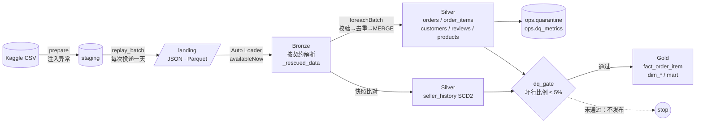

# Olist Lakehouse Pipeline

[日本語](README.md) | [English](README.en.md) | **中文**


这是一个数据工程作品集项目。它把巴西电商数据集 [Olist](https://www.kaggle.com/datasets/olistbr/brazilian-ecommerce)（约 10 万订单）回放成"每天投递的文件"，在 Databricks 上构建 **增量摄取 → 校验与隔离 → CDC / SCD2 → 星型模型**。
回放时会故意注入重复行、迟到数据、非法值、CDC 乱序、schema 变更和卖家迁址。测试证明，管道自己的质量指标能把这些异常全部捕获。

---

## 架构



Databricks Job（`resources/olist_jobs.yml`，serverless）：
`replay_batch → bronze → silver → dim_seller_scd2 → dq_gate → gold → mart`

---

## 5 个工程问题及解法

| 问题 | 解法 | 设计决策 | 代码 | 测试 |
|---|---|---|---|---|
| **增量摄取与重复**（明细重复投递、作业重试） | 带 checkpoint 的 Auto Loader 保证每个文件只摄取一次；批内用 `row_number` 去重，跨批用只插入不更新的 MERGE 忽略已加载的行 | [ADR-0001](docs/adr/zh/0001-idempotent-ingestion-and-dedup.md) | [bronze.py](src/olist_pipeline/bronze.py), [silver.py](src/olist_pipeline/silver.py) | `test_redelivered_item_is_not_counted_twice` |
| **CDC 乱序**（较旧的状态变更后到达） | 只前进的 MERGE：只有 `change_seq` 更大时才更新 | [ADR-0002](docs/adr/zh/0002-cdc-forward-only-merge.md) | `merge_cdc_forward_only` | `test_late_older_change_does_not_regress_status` |
| **SCD Type 2**（卖家迁址后，仍按下单时的所在地统计） | 用哈希检测变更，一次 MERGE 关闭旧版本并插入新版本；事实表按下单日期做时点关联 | [ADR-0003](docs/adr/zh/0003-scd2-sellers.md) | [scd2.py](src/olist_pipeline/scd2.py) | `test_fact_uses_the_seller_version_valid_on_the_order_date` |
| **迟到数据**（算在哪一天？） | 按销售发生日归日；迟到 3 天以内通过 MERGE 回溯修正 Gold，超过 3 天进隔离区 | [ADR-0004](docs/adr/zh/0004-late-data.md) | `add_lateness`, `merge_fact` | `test_late_items_are_accepted_and_dated_by_the_sale` |
| **数据质量**（坏行去哪、谁会发现、何时停止） | 按规则隔离并记录指标；单次运行的坏行比例超过 5% 时不发布 Gold | [ADR-0005](docs/adr/zh/0005-data-quality-gate.md) | [quality.py](src/olist_pipeline/quality.py), [gate.py](src/olist_pipeline/gate.py) | `test_gate_blocked_only_the_poisoned_run` |

其他决策：[订单履约的累积快照](docs/adr/zh/0009-accumulating-snapshot-fulfillment.md)、[每日订单积压的周期快照](docs/adr/zh/0010-periodic-snapshot-backlog.md)、[数据契约与 `_rescued_data`](docs/adr/zh/0006-data-contracts-and-rescued-data.md)、[客户身份归并（`customer_unique_id`）](docs/adr/zh/0007-customer-identity.md)、[命令式与声明式（Lakeflow）的对比](docs/adr/zh/0008-imperative-vs-declarative.md)

---

## 验证结果

### 注入的异常与管道报告的核对

下面是在本地用合成数据运行的结果：一次回填加 6 个每日批次。基础数据本身没有异常，所以管道报告的每个异常都必须是注入的，注入的每个异常也都必须被报告。端到端测试每次运行都会断言这一点。

| 注入的异常（`ops.replay_manifest`） | 注入数 | 对应指标（`ops.dq_metrics`） | 报告数 |
|---|---:|---|---:|
| 负价格 | 8 | `price_not_positive` | 8 |
| 缺失商品 ID | 6 | `missing_product_id` | 6 |
| 不存在的商品 ID | 6 | `unknown_product_id` | 6 |
| 超出容忍的迟到（5 天） | 1 | `too_late` | 1 |
| 同批次重复 | 16 | `duplicate_in_batch` | 16 |
| 次日重复投递 | 8 | `duplicate_already_loaded` | 8 |
| 配送时间早于下单时间 | 3 | `delivered_before_purchase` | 3 |
| 新字段 `discount_amount` | 314 | `rescued_data` | 314 |

### 测试（`uv run pytest`，共 53 个）
- **37 个单元测试**：去重、只前进的 CDC、SCD2（幂等、快照中缺失不等于删除、时点关联）、质量规则边界值、契约解析、客户身份归并、mart 的 GMV 口径。
- **16 个端到端测试**：回填加回放 6 天，最后一天注入约 12% 的坏行。测试核对每一类异常，检查闸门只拦下被污染的那天、重跑不产生任何变化、下一次运行时 Gold 能追上。

### 真实数据（Olist，约 10 万订单）的运行结果

在本地跑了一次回填加 10 个每日批次（共 11 次运行，约 6.5 分钟）。所有运行都通过了闸门，坏行比例最高 2.11%。注入的每类异常都被报告，数量与注入的一致。

真实数据暴露了几个合成数据复现不了的问题，现在都已处理：

| 真实数据中发现的问题 | 规模 | 处理方式 |
|---|---|---|
| 交给承运商的时间早于下单时间（例如 2018-07 下单，2018-01 交给承运商） | 原始数据中 166 个订单（0.17%），回放窗口内 47 条变更 | 新增规则 `change_before_purchase` 将其隔离；否则订单会在下单前几个月就"存在" |
| 品类翻译 CSV 开头有 UTF-8 BOM | 1 个文件 | 读取时去掉列名中的 BOM；测试数据里也加了 BOM，作为回归测试 |
| `customer_id` 每个订单生成一个 | 82,406 个 `customer_id` → 79,682 人 | 按 `customer_unique_id` 建客户维度（ADR-0007） |
| 没有英文翻译的品类 | 13 个商品 | 英文名保留为 NULL，保留原品类名 |
| 订单各阶段顺序颠倒（付款审核前就交给承运商 559、下单前就交给承运商 46、交接前就送达 23） | 628 个订单（0.76%） | 累积快照把负的时长设为 NULL 并打上标记，计入警告指标（ADR-0009） |
| 送达延误与客户满意度 | 准时的 71,451 单平均 4.27 星，迟到的 5,505 单平均 2.21 星（64% 是 1–2 星） | 履约事实表加入评分，Dashboard 按迟到程度显示评分（ADR-0009） |

### 截图（Databricks Free Edition）

**每日作业 `olist_daily`**：在 serverless 上依次运行 7 个任务，每次约 6 分半（连续成功 11 次）。


**数据质量 Dashboard**：11 次运行的坏行比例都远低于 5% 阈值（最高 2.1%），没有运行被闸门拦下。可以按天查看各规则隔离的行数，以及去重和字段转存的行数。


**业务 Dashboard**：基于 Gold 层计算 GMV、准时交付率和各州 GMV，州取自 SCD2 `dim_seller` 中下单时点的值。Dashboard 由 `scripts/build_dashboard.py` 生成，通过 Asset Bundle 部署。


**送达延误与评分**：送达越晚，评分越低。准时送达的订单平均 4.27 星，迟到的只有 2.21 星，迟到订单中 64% 是 1–2 星。比预计提前 7 天以上送达的平均 4.30 星，迟到 8 天以上则降到 1.66 星（`fact_order_fulfillment` 的 `review_score` 和 `hours_late`，ADR-0009）。


---

## 讲解 Notebook（日本語 / English / 中文）

[`notebooks/walkthrough/`](notebooks/walkthrough/) 里有 8 个按层讲解的 notebook。每个都直接导入生产代码的函数，在几行手写数据上运行：改一下输入、重跑，就能看到行为。每个 notebook 最后都有"自己试试"和"面试时怎么说"。CI 每次都会运行全部 notebook，所以讲解不会和代码脱节。

| Notebook | 内容 |
|---|---|
| [`00_overview`](notebooks/walkthrough/00_overview.py) | 总览与代码地图 |
| [`01_replay`](notebooks/walkthrough/01_replay.py) | 静态数据变成每日数据流，注入异常 |
| [`02_bronze_contracts`](notebooks/walkthrough/02_bronze_contracts.py) | 数据契约与 `_rescued_data` |
| [`03_silver_dedup_cdc`](notebooks/walkthrough/03_silver_dedup_cdc.py) | 去重与只前进的 CDC |
| [`04_scd2`](notebooks/walkthrough/04_scd2.py) | 卖家 SCD2 与时点关联 |
| [`05_quality_gate`](notebooks/walkthrough/05_quality_gate.py) | 规则、隔离、指标与闸门 |
| [`06_gold`](notebooks/walkthrough/06_gold.py) | 星型模型、客户身份、GMV 口径 |
| [`07_fulfillment`](notebooks/walkthrough/07_fulfillment.py) | 累积快照、右删失 |
| [`08_backlog`](notebooks/walkthrough/08_backlog.py) | 周期快照、迟到数据修正过去 |

---

## 表清单

| 层 | 表 | 内容 |
|---|---|---|
| Bronze | `olist_bronze.{orders_cdc, order_items, customers, reviews, sellers, products}` | 按契约解析的行、原始行、`_rescued_data`、摄取元数据 |
| Silver | `olist_silver.orders` | 每个订单应用 CDC 后的最新状态 |
| Silver | `olist_silver.order_items` | 去重后的明细，带 `event_date` 和 `arrival_lag_days` |
| Silver | `olist_silver.order_changes` | 校验通过的订单状态变更的只追加日志（审计记录） |
| Silver | `olist_silver.seller_history` | 卖家的 SCD2 历史 |
| Silver | `olist_silver.{customers, reviews, products}` | 已校验的主数据和评论 |
| Gold | `olist_gold.fact_order_item` | 粒度：订单明细；带下单时点的卖家版本 `seller_sk` |
| Gold | `olist_gold.fact_order_fulfillment` | 累积快照：每个订单一行，包含各阶段时间和每个阶段的耗时 |
| Gold | `olist_gold.fact_daily_order_backlog` | 周期快照：按日期 × 状态 × 客户所在州统计未完成订单（数量、金额、年龄、逾期） |
| Gold | `olist_gold.dim_{date, customer, product, seller}` | 维度表；客户按 `customer_unique_id` 归并 |
| Gold | `olist_gold.mart_seller_delivery_performance` | 卖家 × 月：GMV、准时交付率、平均评分 |
| Ops | `olist_ops.{dq_metrics, quarantine, dq_gate_log, replay_manifest}` | 质量指标、隔离区、闸门判定、回放计划（标准答案） |

---

## 运行方式

### 本地（不需要 Databricks 账号）
前置条件：Python 3.12、[uv](https://docs.astral.sh/uv/)、**Java 17 或 21**（PySpark 4 的要求）。

```bash
uv sync --python 3.12
uv run pytest                                   # 单元 + 端到端测试（合成数据，约 4 分钟）

./scripts/download_olist.sh                     # 需要 Kaggle API token
uv run olist run-local --base-path ./data       # 真实数据：回填 + 10 个每日批次
```

### Databricks（按 Free Edition 可运行来设计）
```bash
databricks auth login --host https://<your-workspace>.cloud.databricks.com
./scripts/download_olist.sh
./scripts/deploy_databricks.sh                  # 上传到 Volume → bundle deploy → 运行 olist_setup
databricks bundle run olist_daily               # 每次运行投递并处理一天（重复 10 次）
```

---

## 目录结构

```
src/olist_pipeline/
  contracts.py   6 个数据源的数据契约
  replay.py      Kaggle CSV → 每日文件投递、注入异常、生成 manifest
  bronze.py      Auto Loader / 文件流、契约解析、_rescued_data
  quality.py     规则、隔离、指标
  silver.py      校验 → 去重 → MERGE（CDC 只前进）
  scd2.py        卖家 SCD Type 2
  gate.py        数据质量闸门
  gold.py        星型模型与 mart
  cli.py         作业任务入口（本地与 Databricks 共用）
tests/           单元测试、端到端测试、合成的 Olist 测试数据
resources/       Databricks Asset Bundle 的 Job 定义
docs/adr/        设计决策记录（日文 / 英文 / 中文）
```

## 下一步
- 用 Change Data Feed 把 Gold MERGE 的数据源限定为有变更的键
- 用 Lakeflow Declarative Pipelines 实现同一套规格，并做对比

---

数据：*Brazilian E-Commerce Public Dataset by Olist*（CC BY-NC-SA 4.0）。本仓库不包含数据，需通过脚本下载。
